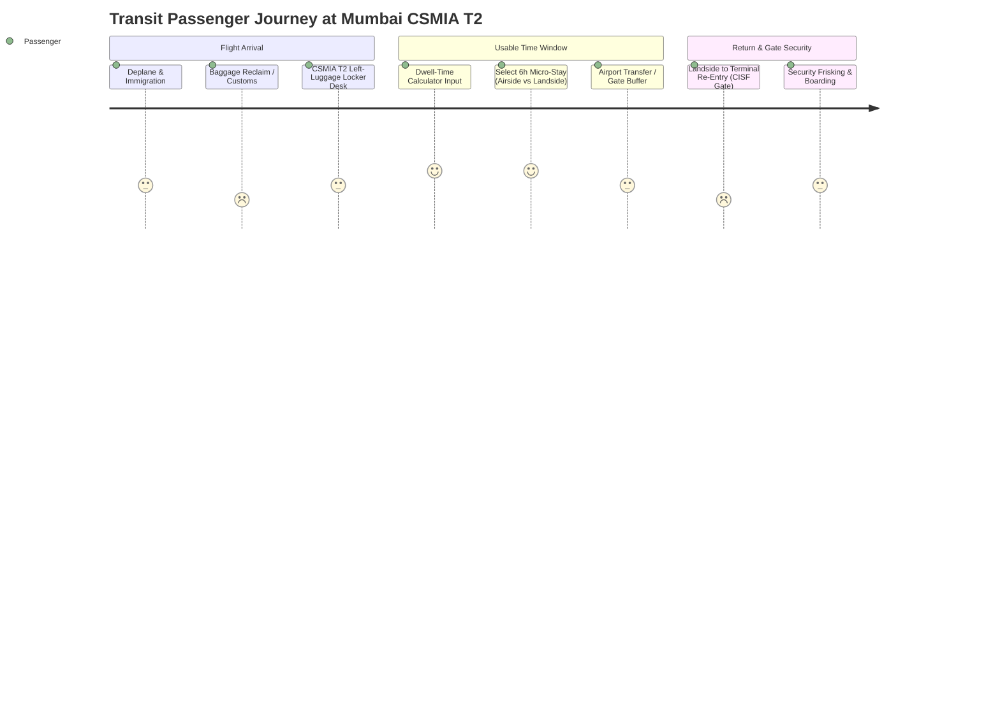

# Phase 1: End-to-End User Experience & Journey Audit
**Target Ecosystem:** Mumbai Chhatrapati Shivaji Maharaj International Airport (CSMIA - BOM) Terminal 2 & Terminal 1  
**Audit Scope:** Transit passenger booking journeys for daytime micro-stays (6-hour slots) and temporary luggage storage, mobile responsiveness, dwell-time calculator accuracy, and checkout microcopy.

---

## 1. Executive Summary & Journey Architecture

LayoverX positions itself as a "Guaranteed Usable-Time Platform" for transit passengers passing through CSMIA (Mumbai). Our audit evaluated the end-to-end booking flow across two primary user intents:
1. **The 6-Hour Daytime Hotel Micro-Stay:** International-to-Domestic and International-to-International transit travelers seeking quiet sleep, hot showers, and Wi-Fi.
2. **Temporary Luggage Storage (Left-Luggage):** Passengers leaving the airport to visit South Mumbai / Bandra or nearby dining without dragging heavy check-in suitcases.

---

## 2. Deep Dive: 6-Hour Daytime Hotel Micro-Stay Journey

### 2.1 Search, Dwell-Time Filtering & Usable Hours Calculation
- **Landing vs. Departure Inputs:**
  - In `app/plan-my-layover/page.tsx` and `components/LayoverCalculatorForm.tsx`, the arrival and departure times default to standard datetime pickers (`2026-07-28T10:00` to `2026-07-28T18:00`).
  - Total layover is computed as 8 hours. The system automatically deducts:
    - Inbound buffer: 45–60 mins (Deplaning, Immigration, Customs).
    - Outbound buffer: 120–150 mins (Domestic: 120 mins; International: 180 mins).
    - Calculated "Usable Time": ~4.5 to 5.2 hours.
- **Micro-Stay Slot Granularity:**
  - In `app/hotels/page.tsx`, the duration selector toggles between **3-Hour** (`price3h`), **6-Hour** (`price6h`), and **Full Night Room** (`priceFullNight`).
  - **Identified Friction:** When a passenger enters an 8-hour layover, the usable time is ~5 hours. If they choose a 6-hour hotel slot, the system warns about time overrun only in certain views. The UI allows adding a 6-hour stay even when the total usable layover is 4.5 hours, risking missed flights unless strictly constrained by the itinerary buffer rules.
- **Airside vs. Landside Proximity Clarity:**
  - `Niranta Airport Transit Hotel` is located *Inside Terminal 2 (Airside & Landside wings)*.
  - `JW Marriott Sahar` and `ITC Maratha` are *Landside* (1.1 km – 1.4 km from T2).
  - **Friction Found:** International transit passengers without an Indian Visa or transit e-Visa cannot access Landside hotels. The current search filter does not prominently flag visa requirements before redirecting international-to-international transit flyers to landside properties.

---

## 3. Deep Dive: Temporary Luggage Storage Journey

### 3.1 Facility Presence & Information Delivery
- In `app/how-it-works/page.tsx` (lines 201–210), luggage lockers are described:
  > *"CSMIA Terminal 2 arrivals locker desk (operated by airport authorities). Rates range from ₹150 to ₹300 per bag."*
- In `data/layover-data.ts`, luggage assistance is listed as an amenity in private cab transfers and pod stays.
- **Critical UX Gap Identified:**
  - There is currently **no dedicated transactional booking item or reserve-and-pay flow** for luggage lockers on the checkout screen.
  - Users are given informational copy, but cannot pre-book guaranteed locker slots during peak holiday rush (when CSMIA arrivals left-luggage counters frequently reach 100% capacity).
  - **Recommendation:** Introduce a dedicated `LuggageLockerWidget` in `PlanMyLayover` and `Checkout` that allows adding `N` bags (Cabin @ ₹199, Check-in @ ₹299) with an instant QR-coded voucher redeemable at the CSMIA T2 ground floor arrivals desk.

---

## 4. Mobile Responsiveness & Touch Target Audit

| View / Component | Screen Width (< 390px) | Tablet (768px) | Desktop (> 1024px) | UX / Accessibility Finding |
|---|---|---|---|---|
| **Sticky Category Pills** (`app/hotels/page.tsx`) | Pass (Overflow scroll) | Pass | Pass | Smooth horizontal scrolling with touch-friendly pills (`px-4 py-2.5`). |
| **Itinerary Drawer / Floating Bar** | Minor overlap | Pass | Pass | On iPhone SE (375px), sticky bottom CTA can overlap hotel card action buttons if z-index is unconstrained. |
| **Layover Timeline Header** | Pass (Stacked view) | Pass | Pass | Responsive layout gracefully collapses milestones from horizontal to vertical. |
| **Checkout Accordion** (`app/checkout/page.tsx`) | Pass | Pass | Pass | Clear touch targets for UPI, Cards, and Netbanking. |

---

## 5. Checkout Microcopy & Trust Engineering

### 5.1 Critical Gaps in Checkout Microcopy
1. **Missed Flight Guarantee Guarantee Details:**
   - The hero promises a "Flight Catch Guarantee", but the checkout step does not articulate the exact conditions (e.g., passenger must depart hotel 2.5 hours before flight, follow LayoverX cab route, and present airport entry receipt).
2. **Security Deposit Transparency:**
   - Day-use hotels (e.g. ITC Maratha, JW Marriott) mandate an incidental card hold (₹2,000–₹5,000) at check-in. This is absent from checkout microcopy, leading to surprise and friction at the front desk.
3. **Cancellation & Flight Delay Buffer:**
   - What happens if the incoming flight is delayed by 3 hours? Microcopy must clarify that the micro-stay slot dynamically shifts or offers a 100% credit shell if notified before departure.

---

## 6. Two-Cycle Critic & Refinement Loop

### Cycle 1: Peak Monsoon Delays on Western Express Highway (WEH)
- **Extreme Scenario:** July/August heavy rainfall in Mumbai. Travel time from Bandra/Juhu back to CSMIA T2 via WEH escalates from 25 mins to 95–130 mins due to Milan Subway or Kalanagar waterlogging.
- **Critic Finding:** The default fallback driving calculation in `utils/routeCalculator.ts` (`calculateFallbackDuration`) caps max drive time to **2.5 hours** across the entire itinerary and 45 minutes for Bandra/BKC. If OSRM times out (set to 2000ms), the system severely underestimates traffic during monsoons.
- **Refinement Action:**
  - Implement a dynamic weather/season multiplier: inject a 1.6x travel buffer between June 15 and September 30 for landside transit itineraries.
  - Require an explicit alert on the checkout page: *"Monsoon Advisory: Western Express Highway transit buffer elevated by +45 minutes."*

### Cycle 2: CISF Terminal Re-Entry Restrictions & Departure Gate Access
- **Extreme Scenario:** A passenger books a 6-hour layover, exits T2 to visit a nearby hotel or restaurant, and attempts to re-enter T2 departures 5 hours before their flight.
- **Regulatory Reality:** Under CISF & Bureau of Civil Aviation Security (BCAS) regulations at CSMIA, passengers are **not permitted entry past the departure terminal gates earlier than 4 hours** prior to domestic departures and 4–5 hours for international departures without special transit clearance.
- **Critic Finding:** Passengers who finish their landside micro-stay early cannot simply "wait inside security". They will be turned away by armed CISF guards at Gate 2/Gate 4.
- **Refinement Action:**
  - The booking voucher and confirmation screen must explicitly display: *"CISF Gate Notice: Terminal 2 departures entry opens exactly at [T-4 Hours]. Please do not vacate your day-room before [Recommended Hotel Departure Time]."*

---

## 7. Actionable UX Enhancement Roadmap
1. **Luggage Storage Add-On:** Embed a 1-click luggage storage upsell card directly within the unified checkout flow.
2. **Airside Visa Gatekeeper:** Add a 1-second modal check: *"Do you hold a valid Indian Visa / OCI card?"* before confirming landside hotel bookings.
3. **Real-Time Traffic Buffer Indicator:** Display live Google Maps / OSRM travel uncertainty bars in the itinerary summary.
