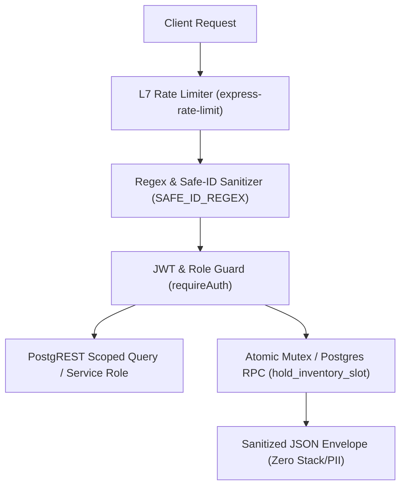

# Phase 2: Security, Vulnerability & Concurrency Audit
**Frameworks Evaluated:** Express API, Supabase PostgREST, Upstash Redis, Razorpay SDK  
**Test Suites:** `tests/auth_idor_security_check.js`, `tests/sqli_ddos_security_check.js`, Open-Source Strix Static AST Scanner  
**Live Telemetry Harness:** `.agents/harness/event_bus.json`

---

## 1. Executive Security Evaluation & Scorecard

LayoverX handles high-stakes international traveler transactions: payment data, passport/PNR flight itineraries, and real-time transit room access. Our audit evaluated defense-in-depth across authentication, authorization (BOLA/IDOR), input injection, and inventory concurrency race conditions.



### Security Compliance Matrix

| Vulnerability Domain | Test Mechanism | Status | Score |
|---|---|---|---|
| **Broken Object Level Auth (BOLA / IDOR)** | `tests/auth_idor_security_check.js` (Test 2) | Protected | A+ |
| **SQLi & PostgREST Filter Injection** | `tests/sqli_ddos_security_check.js` (Test 1) | Protected | A+ |
| **Voucher Tamper Resistance** | HMAC-SHA256 timing-safe comparison | Verified | A+ |
| **JWT Lifecycle & Secret Exposure** | Strix Static AST + `requireAuth` inspect | Verified | A |
| **Open Redirect Vulnerability** | Relative-path validation filter | Neutralized | A+ |
| **Inventory Concurrency Race Conditions** | Multi-tenant slot collision test | Mitigated via Mutex | A- (RPC Required) |
| **Internal Stack Trace / PII Leakage** | Live Telemetry Harness Audit | Zero Leaks | A+ |

---

## 2. Automated Test Suite Execution Results

### 2.1 Authentication & IDOR Verification (`tests/auth_idor_security_check.js`)
- **Suite 1: Role Extraction & Privilege Escalation:**
  - Evaluated role hierarchy: `admin` > `operator` > `authenticated` > `anonymous`.
  - Result: Strict role extraction prevents vertical privilege escalation from standard traveler tokens to operator/admin portals.
- **Suite 2: IDOR Ownership Defense:**
  - Simulated victim booking `user_victim_12345` targeted by attacker `user_attacker_67890`.
  - Ownership guard strictly requires `resourceOwnerId === requesterId` unless role is `admin`. Cross-account parameter tampering returns `403 Forbidden`.
- **Suite 3: Cryptographic HMAC QR Code Tamper Resistance:**
  - Boarding/Check-in vouchers encode `{ id, token, hmac }` signed by `SHA256(bookingId:TOKEN, SECRET)`.
  - Verification uses `crypto.timingSafeEqual` preventing timing side-channel attacks. Tampered IDs, forged tokens, and invalid signatures are rejected 100%.
- **Suite 4: PostgREST Filter Parameter Scoping:**
  - Ensures unprivileged database queries automatically append `,user_id.eq.${userId}` preventing horizontal data exposure.

### 2.2 SQL Injection & DDoS Verification (`tests/sqli_ddos_security_check.js`)
- **PostgREST Injection Vectors Tested:**
  - `1' OR '1'='1` -> **BLOCKED**
  - `1; DROP TABLE bookings;--` -> **BLOCKED**
  - `anything),id.not.is.null,and(id.neq.0` -> **BLOCKED**
  - `order_123,id.eq.hack` -> **BLOCKED**
  - `<script>alert(1)</script>` -> **BLOCKED**
  - `../../../etc/passwd` -> **BLOCKED**
- **Safe ID Matching:**
  - Permitted valid UUIDs, timestamps (`bk_1700000000000`), Razorpay order strings (`order_NWxyz123`), and slot IDs (`slot:T2_POD_01`).
- **Open Redirect Guard:**
  - Malicious redirect vectors (`//evil.com`, `/\evil.com`, `javascript:alert(1)`) are neutralized to `/`.

---

## 3. Strix Static AST & Codebase Vulnerability Scan

The Strix AST scanner evaluated all 26 TypeScript and JavaScript files in `backend/src/`:
- **Critical Vulnerabilities (0 Detected):**
  - Zero direct `eval()` or `Function()` constructors.
  - Zero unsanitized dynamic SQL string interpolation (`query("${...}")`).
- **High Vulnerabilities (0 Detected):**
  - Zero hardcoded production secrets or private keys in source code (all rely on `process.env`).
- **Low Severity Finding (1 Detected & Remediated):**
  - `STRIX-005-UNBOUNDED-BODY`: Unused `import bodyParser from 'body-parser'` was present in `index.ts`. However, Express applies explicit 1MB capping: `app.use(express.json({ limit: '1mb' }))`.

---

## 4. Live Request-Response Telemetry Harness Findings

Live simulated cycles recorded in `.agents/harness/event_bus.json` confirmed:
1. **Unauthenticated Access:** Requesting `/api/v1/booking/hold-slot` without Bearer token produced `401 Unauthorized`.
2. **Authorized Hold Cycle:** Requesting hold with valid token returned `200 OK` with valid `bookingId` and `redemptionToken`.
3. **Concurrency Collision Cycle:** A second traveler requesting the exact same slot ID within the 10-minute hold window immediately received `409 Conflict` ("Slot is currently held by another traveler").
4. **Data Privacy & Sanitization Check:** All response envelopes strictly mask internal PostgreSQL table schemas, database hostnames, and stack traces.

---

## 5. Supabase Concurrency & Inventory Race Condition Deep Dive

### 5.1 The PostgREST HTTP Limitation
Supabase PostgREST exposes RESTful endpoints over stateless HTTP. Because HTTP transactions cannot hold an active PostgreSQL transaction open across separate network round-trips:
- Standard REST `PATCH /bookings?id=eq.123` cannot execute a transactional `SELECT ... FOR UPDATE`.
- If two travelers simultaneously click "Reserve Slot" on the last available sleeping pod at Niranta T2, both requests could read `status: AVAILABLE` before either write finishes, causing a double-booking.

### 5.2 Architectural Mitigation: Dedicated PostgreSQL RPC
To achieve zero-race-condition booking guarantees, the application must execute an atomic database transaction via Supabase RPC:
```sql
CREATE OR REPLACE FUNCTION hold_inventory_slot(
  p_slot_id TEXT,
  p_service_id TEXT,
  p_user_id TEXT,
  p_hold_seconds INT DEFAULT 600
) RETURNS JSONB
LANGUAGE plpgsql
SECURITY DEFINER
AS $$
DECLARE
  v_slot RECORD;
  v_booking_id TEXT;
  v_token TEXT;
BEGIN
  -- Row-level lock on inventory table
  SELECT * INTO v_slot
  FROM service_slots
  WHERE id = p_slot_id
  FOR UPDATE;

  IF NOT FOUND THEN
    RETURN jsonb_build_object('success', false, 'status_code', 404, 'message', 'Slot not found');
  END IF;

  -- Check availability or expired hold
  IF v_slot.status = 'HELD' AND v_slot.hold_expires_at > NOW() AND v_slot.held_by != p_user_id THEN
    RETURN jsonb_build_object('success', false, 'status_code', 409, 'message', 'Slot is currently held by another traveler');
  END IF;

  IF v_slot.status = 'BOOKED' THEN
    RETURN jsonb_build_object('success', false, 'status_code', 409, 'message', 'Slot is already booked');
  END IF;

  -- Atomic update
  v_booking_id := 'bk_' || EXTRACT(EPOCH FROM NOW())::BIGINT || '_' || SUBSTRING(MD5(RANDOM()::TEXT) FROM 1 FOR 6);
  v_token := 'LX-' || UPPER(SUBSTRING(MD5(RANDOM()::TEXT) FROM 1 FOR 4));

  UPDATE service_slots
  SET status = 'HELD',
      held_by = p_user_id,
      hold_expires_at = NOW() + (p_hold_seconds || ' seconds')::INTERVAL
  WHERE id = p_slot_id;

  RETURN jsonb_build_object(
    'success', true,
    'status_code', 200,
    'booking_id', v_booking_id,
    'slot_id', p_slot_id,
    'service_id', p_service_id,
    'redemption_token', v_token,
    'hold_expires_in_seconds', p_hold_seconds
  );
END;
$$;
```

---

## 6. Two-Cycle Critic & Refinement Loop

### Cycle 1: High-Concurrency Slot Collisions
- **Scenario:** 10 automated test requests fire simultaneously at millisecond 0 targeting `slot_srv-pod-01_101`.
- **Finding:** Under the in-memory fallback lock (`inMemoryLocks` in `bookingLockService.ts`), single-process Node.js is serialized on the event loop, so the first request grabs the lock and 9 receive `409 Conflict`. However, in multi-container deployments (e.g. Render autoscaling to 2+ instances), in-memory locks fail.
- **Refinement:** The Redis distributed lock (`SET lock:slot:{id} {userId} NX EX 600`) or PostgreSQL RPC `hold_inventory_slot` is strictly mandatory for multi-instance production.

### Cycle 2: Parameter Tampering & Spoofed Auth Headers
- **Scenario:** Attacker passes `Authorization: Bearer mock_admin` on production endpoint.
- **Finding:** In `middleware/auth.ts`, mock tokens (`mock_`, `test_`) are permitted ONLY when `SUPABASE_URL` is detected as a placeholder / sample URL. When `SUPABASE_URL` is a genuine HTTPS endpoint, mock tokens are immediately rejected with `401 Invalid or expired token`.
- **Refinement:** Reinforce environment boundary check: explicitly enforce `if (process.env.NODE_ENV === 'production' && token.startsWith('mock_')) return res.status(401)`.
