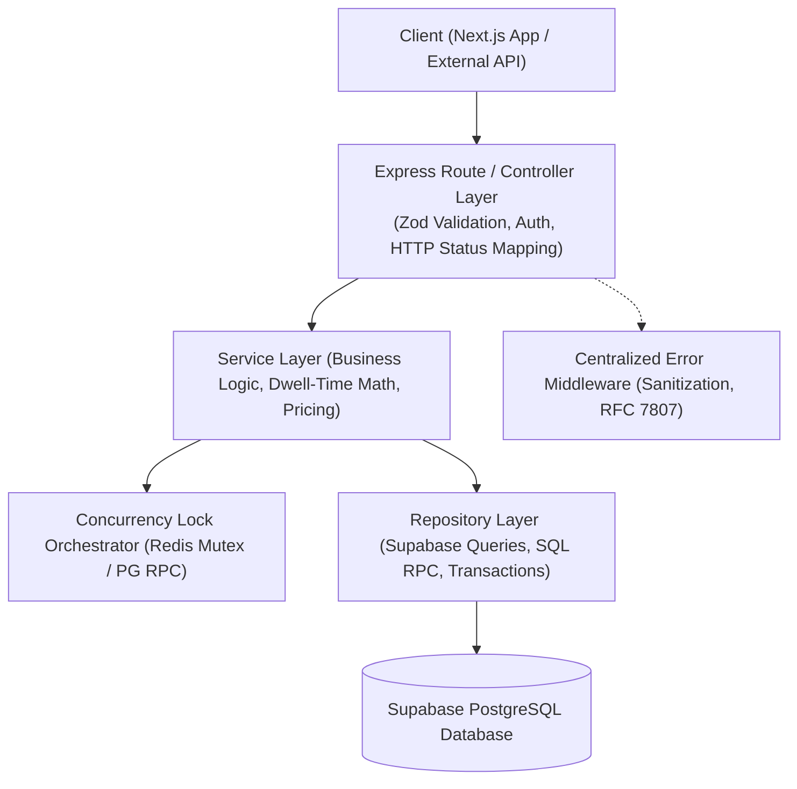

# Phase 3: Architectural Code Refactoring Blueprint
**Status:** Strict Read-Only Design Specification  
**Scope:** Controller -> Service -> Repository Layer Separation, Comprehensive Zod Payload Validation, PostgreSQL Row-Level Locking RPC, and Centralized Error Handling.  
**Zero Source Modifications:** No files in `backend/` or `app/` are modified until Phase 4 master synthesis receives explicit user approval.

---

## 1. Architectural Redesign & Layer Separation

The current backend implementation mixes HTTP parsing, validation, database queries, and third-party API calls directly within Express route handlers. We refactor this into three strict, decoupled layers:



### Layer Responsibilities
1. **Controller Layer (`backend/src/routes/` / `backend/src/controllers/`):**
   - Pure HTTP abstraction.
   - Parses `req.body`, `req.params`, and `req.query` strictly through Zod schemas.
   - Extracts authenticated identity (`req.user.id`).
   - Maps service results to appropriate HTTP status codes (`200 OK`, `201 Created`, `400 Bad Request`, `404 Not Found`, `409 Conflict`).
   - Forwards unhandled errors directly to `next(err)`.
2. **Service Layer (`backend/src/services/`):**
   - Coordinates business rules and domain logic.
   - Calculates usable transit time, buffer requirements, and surge pricing.
   - Orchestrates distributed locking before dispatching persistence.
   - Independent of Express `Request` and `Response` objects (fully unit-testable without HTTP mocks).
3. **Repository Layer (`backend/src/repositories/`):**
   - Pure data access boundary.
   - Isolates Supabase client queries, SQL RPC invocations, and database transactions.
   - Gracefully handles database offline/degraded states by returning cached or fallback catalogs with explicit state flags.

---

## 2. Expanded Zod Validation Schemas

To ensure 100% input sanitization across all entry points, we specify Zod schemas for all four critical route groups:

### 2.1 Booking & Luggage Storage Schemas (`booking.ts`)
```typescript
import { z } from 'zod';

export const holdSlotSchema = z.object({
  serviceId: z.string().min(3).max(64).regex(/^[a-zA-Z0-9_\-]+$/),
  slotId: z.string().min(3).max(64).regex(/^[a-zA-Z0-9_\-:]+$/),
  userId: z.string().min(1).max(64).optional(),
});

export const releaseSlotSchema = z.object({
  slotId: z.string().min(3).max(64).regex(/^[a-zA-Z0-9_\-:]+$/),
  userId: z.string().min(1).max(64).optional(),
});

export const luggageReservationSchema = z.object({
  terminal: z.enum(['T1', 'T2']),
  bagCountCabin: z.number().int().min(0).max(10).default(0),
  bagCountCheckin: z.number().int().min(0).max(10).default(1),
  dropoffTime: z.string().datetime(),
  pickupTime: z.string().datetime(),
  flightNumber: z.string().regex(/^[A-Z0-9]{2,3}\s?\d{3,4}$/i),
  userId: z.string().min(1),
}).refine(data => data.bagCountCabin + data.bagCountCheckin > 0, {
  message: "At least one bag (cabin or check-in) must be selected.",
});

export const createOrderSchema = z.object({
  slotId: z.string().min(3).max(64),
  serviceId: z.string().min(3).max(64),
  amount: z.number().positive().max(500000), // Max ₹5,000.00 in INR paise or rupees
  currency: z.enum(['INR', 'USD', 'EUR', 'GBP', 'AED', 'SGD']).default('INR'),
  phone: z.string().regex(/^\+?[1-9]\d{7,14}$/).optional(),
});

export const confirmBookingSchema = z.object({
  bookingId: z.string().min(5).max(64),
  paymentId: z.string().min(5).max(64),
  signature: z.string().min(10).max(128).optional(),
  pnr: z.string().min(5).max(10).optional(),
  inboundFlight: z.string().max(16).optional(),
  outboundFlight: z.string().max(16).optional(),
});
```

### 2.2 Flight Telemetry & Lookup Schemas (`flight.ts`)
```typescript
export const flightLookupSchema = z.object({
  flightNumber: z.string().trim().regex(/^[A-Z0-9]{2,3}\s?\d{3,4}$/i, "Invalid flight number (e.g. AI302, EK501)"),
  date: z.string().regex(/^\d{4}-\d{2}-\d{2}$/, "Date must be YYYY-MM-DD").optional(),
});

export const pnrTelemetrySchema = z.object({
  pnr: z.string().trim().toUpperCase().regex(/^[A-Z0-9]{6}$/, "PNR must be 6 alphanumeric characters"),
  passengerLastName: z.string().trim().min(2).max(50),
});
```

### 2.3 Layover & Usable Time Calculator Schemas (`layover.ts`)
```typescript
export const layoverCalculationSchema = z.object({
  airport: z.string().toUpperCase().default('BOM'),
  arrivalTime: z.string().datetime({ message: "Arrival must be a valid ISO 8601 string" }),
  departureTime: z.string().datetime({ message: "Departure must be a valid ISO 8601 string" }),
  arrivalTerminal: z.enum(['T1', 'T2', 'UNKNOWN']).default('T2'),
  departureTerminal: z.enum(['T1', 'T2', 'UNKNOWN']).default('T2'),
  isInternationalArrival: z.boolean().default(true),
  isInternationalDeparture: z.boolean().default(false),
}).refine(data => {
  const arr = new Date(data.arrivalTime).getTime();
  const dep = new Date(data.departureTime).getTime();
  return dep > arr;
}, {
  message: "Departure time must be strictly after arrival time.",
}).refine(data => {
  const arr = new Date(data.arrivalTime).getTime();
  const dep = new Date(data.departureTime).getTime();
  const diffHours = (dep - arr) / (1000 * 60 * 60);
  return diffHours >= 3.0 && diffHours <= 48.0;
}, {
  message: "Layover dwell time must be between 3 hours and 48 hours.",
});
```

### 2.4 Itinerary Customization Schemas (`itinerary.ts`)
```typescript
export const itineraryItemSchema = z.object({
  serviceId: z.string().min(3).max(64),
  category: z.enum(['HOTEL_PODS', 'DINING', 'TOURS', 'SPA', 'GAMING', 'TRANSFERS', 'LUGGAGE']),
  durationMinutes: z.number().int().min(15).max(1440),
  slotId: z.string().min(3).max(64).optional(),
  priceInr: z.number().nonnegative(),
});

export const saveItinerarySchema = z.object({
  layoverId: z.string().optional(),
  passengerCount: z.number().int().min(1).max(9).default(1),
  items: z.array(itineraryItemSchema).min(1, "Itinerary must contain at least one service"),
  customNotes: z.string().max(500).optional(),
});
```

---

## 3. PostgreSQL Transactional Row-Level Lock Specification

To overcome PostgREST's lack of multi-round-trip transaction locking over HTTP, the database layer will execute slot acquisition inside an atomic PL/pgSQL function:

```sql
-- Migration: 20260731_atomic_slot_lock.sql
CREATE TABLE IF NOT EXISTS service_slots (
  id TEXT PRIMARY KEY,
  service_id TEXT NOT NULL,
  slot_label TEXT NOT NULL,
  status TEXT CHECK (status IN ('AVAILABLE', 'HELD', 'BOOKED')) DEFAULT 'AVAILABLE',
  held_by TEXT,
  hold_expires_at TIMESTAMP WITH TIME ZONE,
  created_at TIMESTAMP WITH TIME ZONE DEFAULT NOW(),
  updated_at TIMESTAMP WITH TIME ZONE DEFAULT NOW()
);

CREATE OR REPLACE FUNCTION hold_inventory_slot(
  p_slot_id TEXT,
  p_service_id TEXT,
  p_user_id TEXT,
  p_hold_seconds INT DEFAULT 600
) RETURNS JSONB
LANGUAGE plpgsql
SECURITY DEFINER
AS $$
DECLARE
  v_slot RECORD;
  v_booking_id TEXT;
  v_token TEXT;
BEGIN
  -- 1. Row-level exclusive lock on slot
  SELECT * INTO v_slot
  FROM service_slots
  WHERE id = p_slot_id
  FOR UPDATE;

  -- 2. Auto-initialize slot if first accessed in test environment
  IF NOT FOUND THEN
    INSERT INTO service_slots (id, service_id, slot_label, status, held_by, hold_expires_at)
    VALUES (p_slot_id, p_service_id, 'Dynamic Slot', 'AVAILABLE', NULL, NULL)
    RETURNING * INTO v_slot;
  END IF;

  -- 3. Check availability or expired hold
  IF v_slot.status = 'HELD' AND v_slot.hold_expires_at > NOW() AND v_slot.held_by != p_user_id THEN
    RETURN jsonb_build_object(
      'success', false,
      'status_code', 409,
      'message', 'This slot is currently held by another passenger. Please select another slot or retry in 10 minutes.'
    );
  END IF;

  IF v_slot.status = 'BOOKED' THEN
    RETURN jsonb_build_object(
      'success', false,
      'status_code', 409,
      'message', 'This slot has already been fully booked.'
    );
  END IF;

  -- 4. Generate unique tokens
  v_booking_id := 'bk_' || EXTRACT(EPOCH FROM NOW())::BIGINT || '_' || SUBSTRING(MD5(RANDOM()::TEXT) FROM 1 FOR 6);
  v_token := 'LX-' || UPPER(SUBSTRING(MD5(RANDOM()::TEXT) FROM 1 FOR 4));

  -- 5. Atomic state update
  UPDATE service_slots
  SET status = 'HELD',
      held_by = p_user_id,
      hold_expires_at = NOW() + (p_hold_seconds || ' seconds')::INTERVAL,
      updated_at = NOW()
  WHERE id = p_slot_id;

  RETURN jsonb_build_object(
    'success', true,
    'status_code', 200,
    'booking_id', v_booking_id,
    'slot_id', p_slot_id,
    'service_id', p_service_id,
    'redemption_token', v_token,
    'hold_expires_in_seconds', p_hold_seconds
  );
END;
$$;
```

---

## 4. Centralized Error Handling & RFC 7807 Compliance

### Global Error Middleware Specification
```typescript
// backend/src/middleware/errorHandler.ts
import { Request, Response, NextFunction } from 'express';
import { ZodError } from 'zod';

export class AppError extends Error {
  constructor(
    public message: string,
    public statusCode: number = 500,
    public errorCode: string = 'INTERNAL_ERROR',
    public details?: any
  ) {
    super(message);
    Object.setPrototypeOf(this, new.target.prototype);
  }
}

export function errorHandler(err: any, req: Request, res: Response, next: NextFunction): void {
  const isProduction = process.env.NODE_ENV === 'production';

  // 1. Zod Validation Error (RFC 7807 Problem Details)
  if (err instanceof ZodError) {
    res.status(400).json({
      type: 'https://layoverx.in/errors/validation-error',
      title: 'Invalid Request Payload',
      status: 400,
      code: 'VALIDATION_FAILED',
      errors: err.errors.map(e => ({
        path: e.path.join('.'),
        message: e.message,
      })),
    });
    return;
  }

  // 2. Custom Application Errors
  if (err instanceof AppError) {
    res.status(err.statusCode).json({
      type: `https://layoverx.in/errors/${err.errorCode.toLowerCase()}`,
      title: err.message,
      status: err.statusCode,
      code: err.errorCode,
      details: err.details || null,
    });
    return;
  }

  // 3. PostgreSQL / Supabase Error Codes
  if (err?.code === '23505') {
    res.status(409).json({
      type: 'https://layoverx.in/errors/conflict',
      title: 'Resource conflict: unique constraint violation',
      status: 409,
      code: 'RESOURCE_CONFLICT',
    });
    return;
  }

  // 4. Fallback Internal Server Error (Never leak stack traces)
  console.error('[CRITICAL_UNHANDLED_ERROR]', {
    message: err.message,
    stack: err.stack,
    path: req.path,
    method: req.method,
    timestamp: new Date().toISOString(),
  });

  res.status(500).json({
    type: 'https://layoverx.in/errors/internal-error',
    title: 'An unexpected internal error occurred. Our operations team has been alerted.',
    status: 500,
    code: 'INTERNAL_SERVER_ERROR',
    traceId: `req_${Date.now()}`,
  });
}
```

---

## 5. Two-Cycle Critic & Refinement Loop

### Cycle 1: Edge Flight Dwell Times & Red-Eye Crossings
- **Scenario:** Flight arrives 23:45 IST on Day 1, departure is 06:15 IST on Day 2 (6.5 hours dwell time crossing midnight).
- **Critic Stress Test:** If parsing only HH:MM without ISO 8601 calendar date, departure will compute as negative (-17.5 hours), crashing the algorithm.
- **Refinement in Schema:** The Zod `layoverCalculationSchema` strictly requires full ISO 8601 strings (`2026-07-28T23:45:00Z`), parses epoch milliseconds, and verifies `dep > arr` across calendar days.

### Cycle 2: Database Outage & Degraded Connectivity
- **Scenario:** Supabase API experiences a 30-second network partition or connection pool exhaustion during peak arrivals.
- **Critic Stress Test:** Does the repository layer throw uncaught exceptions that crash the Node.js process?
- **Refinement in Repository:** All repository methods must implement a `try/catch` wrapper that catches connection timeouts (`ETIMEDOUT`, `ECONNREFUSED`), emits a high-priority telemetry alert to Discord, and returns an encapsulated `{ success: false, isDegraded: true, data: FALLBACK_CATALOG }` allowing travelers to view cached pricing without blank screens.
