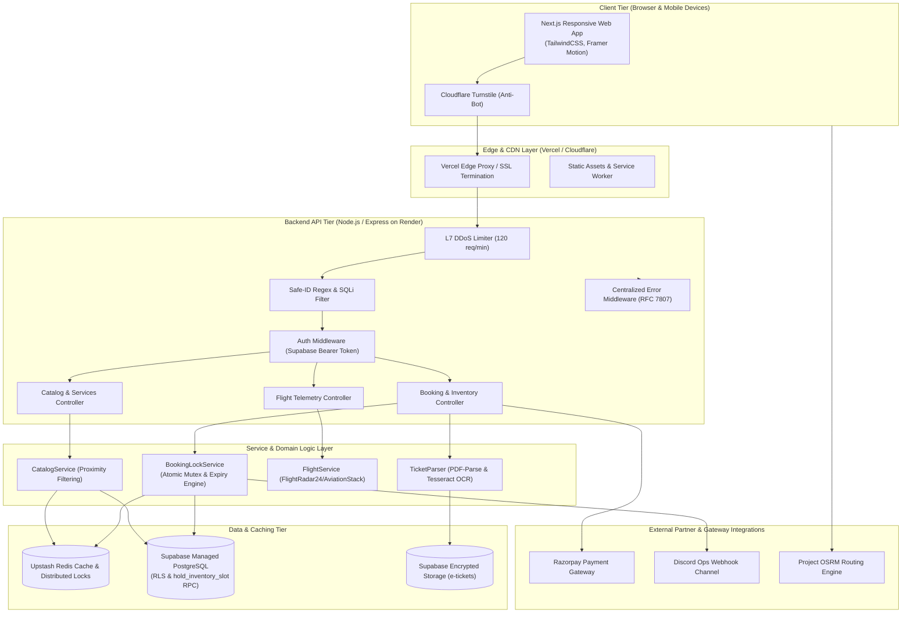

# Phase 4: Master Architecture Specification
**Platform:** LayoverX Hybrid Cloud Transit Engine  
**Runtime:** Next.js (Frontend / Edge SSR on Vercel) + Node.js Express (API Gateway on Render) + Supabase (Managed PostgreSQL) + Upstash Redis (Distributed Locks & Catalog Cache)

---

## 1. System Architecture Diagram



---

## 2. API Endpoint Catalog & Contract Schemas

### 2.1 Inventory & Slot Locking
- **`POST /api/v1/booking/hold-slot`**
  - **Auth:** Bearer JWT required (`requireAuth`)
  - **Rate Limit:** 30 req/min
  - **Request Body (Zod `holdSlotSchema`):**
    ```json
    {
      "serviceId": "srv-pod-01",
      "slotId": "slot_pod_101",
      "userId": "usr_9421_traveler"
    }
    ```
  - **Success Response (`200 OK`):**
    ```json
    {
      "status": "success",
      "message": "Slot held successfully for 10 minutes.",
      "bookingId": "bk_1789192400",
      "slotId": "slot_pod_101",
      "serviceId": "srv-pod-01",
      "paymentStatus": "HELD",
      "expiresAt": "2026-09-12T11:35:00.000Z",
      "redemptionToken": "LX-9421"
    }
    ```
  - **Conflict Response (`409 Conflict`):**
    ```json
    {
      "type": "https://layoverx.in/errors/conflict",
      "title": "This slot is currently held by another passenger. Please select another slot or retry in 10 minutes.",
      "status": 409,
      "code": "SLOT_ALREADY_HELD"
    }
    ```

- **`POST /api/v1/booking/release-slot`**
  - **Auth:** Bearer JWT required
  - **Request Body:** `{ "slotId": "slot_pod_101", "userId": "usr_9421_traveler" }`
  - **Response (`200 OK`):** `{ "status": "success", "message": "Slot released successfully." }`

---

### 2.2 Catalog & Proximity Services
- **`GET /api/v1/services`**
  - **Query Parameters:**
    - `category`: `HOTEL_PODS` | `DINING` | `TOURS` | `SPA` | `GAMING` | `TRANSFERS`
    - `usableMinutes`: Integer (e.g. `240` for a 4-hour window)
    - `terminal`: `T1` | `T2`
  - **Headers Returned:** `X-Cache: HIT` or `X-Cache: MISS` (Upstash 300s TTL)
  - **Response (`200 OK`):**
    ```json
    {
      "status": "success",
      "count": 2,
      "data": [
        {
          "id": "srv-pod-01",
          "title": "3-Hour Pod Stay & Hot Shower",
          "category": "HOTEL_PODS",
          "hourlyRate": 2500,
          "currency": "INR",
          "minUsableMinutes": 180,
          "rating": 4.8,
          "vendor": {
            "name": "Niranta Airport Transit Hotel",
            "proximity": "Inside Terminal 2",
            "coords": { "lat": 19.0896, "lng": 72.8742 }
          }
        }
      ]
    }
    ```

---

### 2.3 Layover Usable Time Engine
- **`POST /api/v1/layover/calculate`**
  - **Request Body (Zod `layoverCalculationSchema`):**
    ```json
    {
      "airport": "BOM",
      "arrivalTime": "2026-07-28T10:00:00Z",
      "departureTime": "2026-07-28T18:00:00Z",
      "arrivalTerminal": "T2",
      "departureTerminal": "T2",
      "isInternationalArrival": true,
      "isInternationalDeparture": false
    }
    ```
  - **Response (`200 OK`):**
    ```json
    {
      "status": "success",
      "data": {
        "totalDwellMinutes": 480,
        "inboundBufferMinutes": 60,
        "outboundBufferMinutes": 120,
        "safetyCushionMinutes": 30,
        "usableMinutes": 270,
        "usableHours": 4.5,
        "isFeasible": true,
        "recommendedZones": ["in-terminal", "near-t2"]
      }
    }
    ```

---

### 2.4 Checkout & Payment Confirmation
- **`POST /api/v1/booking/create-checkout-order`**
  - **Multipart Form-Data:**
    - `ticket`: PDF/JPEG/PNG binary file (Magic byte validated, max 10MB)
    - `phone`: `+919876543210`
    - `isConsented`: `true` (DPDP Act 2023 consent record)
    - `slotId`: `slot_pod_101`
    - `serviceId`: `srv-pod-01`
    - `amount`: `3499`
  - **Response (`200 OK`):**
    ```json
    {
      "status": "success",
      "orderId": "order_NWxyz123456",
      "amount": 349900,
      "currency": "INR",
      "bookingId": "bk_1789192400"
    }
    ```

- **`POST /api/v1/payments/verify`**
  - **Request Body:**
    ```json
    {
      "razorpay_order_id": "order_NWxyz123456",
      "razorpay_payment_id": "pay_NWxyz789",
      "razorpay_signature": "e3b0c44298fc1c149afbf4c8996fb92427ae41e4649b934ca495991b7852b855",
      "bookingId": "bk_1789192400"
    }
    ```
  - **Response (`200 OK`):**
    ```json
    {
      "status": "success",
      "message": "Payment verified and booking confirmed.",
      "voucher": {
        "bookingId": "bk_1789192400",
        "redemptionToken": "LX-9421",
        "hmac": "9f83c076722...32chars",
        "qrPayload": "{\"id\":\"bk_1789192400\",\"token\":\"LX-9421\",\"hmac\":\"...\"}"
      }
    }
    ```

---

## 3. Operational Maintenance & Deployment Checklist

### 3.1 Production Environment Deployment (Render & Vercel)
- [ ] **Node.js Environment:** `NODE_ENV=production`, `PORT=5000`.
- [ ] **Proxy Configuration:** `app.set('trust proxy', 1)` verified for accurate client IP rate limiting behind Cloudflare/Render load balancers.
- [ ] **Keep-Alive Worker:** Ensure background ping utility runs every 10 minutes (`startKeepAlive`) preventing free/standard web service cold-start delays.
- [ ] **Payload Limits:** Strict 1MB capping on JSON payloads (`express.json({ limit: '1mb' })`) and 10MB on ticket uploads (`multer({ limits: { fileSize: 10 * 1024 * 1024 } })`).

### 3.2 Supabase PostgreSQL & RLS Hardening
- [ ] **Row Level Security (RLS):**
  - Ensure `services` table has public SELECT enabled.
  - Ensure `bookings` and `service_slots` have `RESTRICT DIRECT MODIFICATION` enabled (`USING (false) WITH CHECK (false)`) so only server-side service role key or `SECURITY DEFINER` RPC functions can write.
- [ ] **Connection Pooling:** Configure Supabase Transaction Pooler (Port 6543 / Supavisor) to prevent PostgreSQL `max_connections` exhaustion during arrival traffic spikes.
- [ ] **Migration Check:** Deploy `20260730_payout_ledger.sql` and `20260731_atomic_slot_lock.sql`.

### 3.3 Redis Cache & Distributed Lock Management
- [ ] **Upstash Redis Configuration:** Verify `UPSTASH_REDIS_REST_URL` and `UPSTASH_REDIS_REST_TOKEN` in production secrets.
- [ ] **Lock Expiration Policy:** All lock keys must enforce strict TTL (`EX 600` seconds). Zero orphan locks permitted.
- [ ] **Key Namespace Isolation:** Use strict prefixes: `lock:slot:{id}` for mutexes and `catalog:cat={cat}` for cached services.

### 3.4 Secret Management & Key Rotation Policy
- [ ] **Razorpay Live Credentials:** Ensure `RAZORPAY_KEY_ID` starts with `rzp_live_` and `RAZORPAY_WEBHOOK_SECRET` is configured.
- [ ] **HMAC Secret Key:** Set a dedicated 64-character hexadecimal `VOUCHER_HMAC_SECRET` separate from Supabase service keys.
- [ ] **Quarterly Key Rotation:** Rotate Supabase JWT secret and Razorpay API secret on a 90-day recurring maintenance window.
