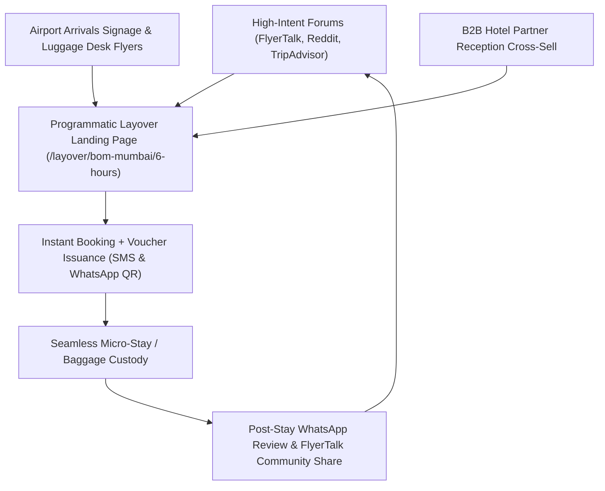

# Phase 6: Customer Acquisition & Go-To-Market (GTM) Strategy
**Beachhead Hub:** Mumbai Chhatrapati Shivaji Maharaj International Airport (CSMIA - BOM) Terminal 2  
**Target Demographic:** Long-haul transit flyers (US/Europe to Southeast Asia/Australia via India, Gulf-to-Domestic transits, and red-eye domestic connections).  
**Execution Horizon:** 0 to 1,000 Booked Transit Travelers in Months 1–6.

---

## 1. Zero-to-One Acquisition Flywheel

---

## 2. High-Intent Organic Community Infiltration

Transit flyers do not browse generic OTA sites; they ask hyper-specific questions on specialized travel forums 3 to 14 days before departing.

### 2.1 FlyerTalk & Reddit Playbook
- **Primary Channels:**
  - *FlyerTalk:* "India & South Asia" Forum, "Air India / Vistara Flying Returns", and "Mumbai Layover / Transit Hotels" threads.
  - *Reddit:* `r/travel`, `r/india`, `r/mumbai`, `r/digitalnomad`, `r/churning`.
  - *TripAdvisor:* "Mumbai Travel Forum" (Over 1,200 active threads asking: *"What to do during 7 hours at BOM?"*).
- **Execution Strategy:**
  - Create genuine, high-karma founder and community-advocate profiles providing granular transit advice:
    - *Example response:* "At CSMIA T2, if your layover is under 5 hours, do not leave the airport. If you have 6–8 hours and an Indian visa, avoid South Mumbai due to WEH traffic. Book a 6-hour daytime room at Niranta (inside T2) or JW Marriott Sahar (1.2 km away) using LayoverX to get hourly slots with flight delay insurance."
  - Publish the authoritative open-source **"Mumbai CSMIA T2 Transit Survival Guide"** on GitHub and Reddit, driving organic backlinks and brand authority.

---

## 3. B2B Hotel Partnership Framework (Sahar & Andheri East)

### 3.1 Target Partner Ecosystem
1. **Niranta Airport Transit Hotel (Inside T2):**
   - *Value Proposition:* Monopolizes airside transit passengers who have no Indian visas.
   - *Partnership Model:* Off-peak inventory allocation (10:00 AM to 06:00 PM) when night rooms are vacant between standard checkout (11:00 AM) and standard check-in (03:00 PM).
2. **ITC Maratha & JW Marriott Mumbai Sahar (1.1–1.4 km from T2):**
   - *Value Proposition:* Luxury day-use packaging (Pool + Spa + Buffet Lunch + 6h Day Room).
   - *Margin Split:* 80% to hotel partner, 20% platform commission (automated via `payout_ledger` database ledger).
3. **Urbanpod & Sleeping Pod Operators (Andheri/Sahar):**
   - *Value Proposition:* Budget micro-stays (₹1,499 for 3 hours) for solo tech workers and backpackers.

### 3.2 Inventory Sourcing Pitch: The "Daytime RevPAR Booster"
Hotels face a structural "dead-occupancy" valley between 11:00 AM and 05:00 PM where rooms generate zero revenue. LayoverX turns this idle inventory into incremental revenue without cannibalizing overnight corporate rack rates.

---

## 4. Ground-Game & Airport Co-Marketing

1. **CSMIA T2 Left-Luggage Counter Partnership:**
   - Co-brand baggage tags and luggage claim slips: *"Free ₹200 Day-Room Voucher on your next LayoverX booking."*
2. **Airline Crew & Travel Agent Referral Program:**
   - Offer Emirates, Qatar Airways, Air India, and Singapore Airlines long-haul cabin crew an exclusive 15% discount for their layover stays, turning flight attendants into active word-of-mouth advocates.
3. **Airport Chauffeur Dispatch Network:**
   - Partner with pre-vetted fleet drivers stationed at CSMIA T2 P4 parking to guarantee zero-wait pickups with flight delay tracking.

---

## 5. First 180 Days KPI Milestones
- **Month 1–2:** Launch 4 B2B hotel partners (Niranta, ITC Maratha, JW Marriott, Urbanpod) with 25 guaranteed daily day-use rooms.
- **Month 3–4:** Reach 15 daily bookings at CSMIA T2 with an Average Order Value (AOV) of ₹3,800 (~$45 USD) and zero missed flight incidents.
- **Month 5–6:** Expand from BOM to Delhi Indira Gandhi International Airport (DEL Terminal 3).
