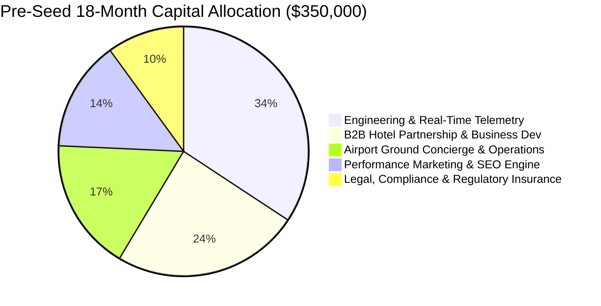

# Phase 7: Founder Advisory: Valuation, Fundraising & Legal Compliance
**Company Stage:** Pre-Seed / Seed Transition  
**Jurisdiction:** India (Primary Operating Entity) + Delaware / Singapore Holding Flipping Structure  
**Core Regulations:** Digital Personal Data Protection (DPDP) Act 2023, Indian Contract Act 1872 (Bailment), Information Technology Act 2000 (Section 79 Safe-Harbor).

---

## 1. Pre-Seed Financing & i-SAFE Capital Modeling

### 1.1 Instrument: India Simple Agreement for Future Equity (i-SAFE)
- **Structure:** 100% equity-convertible note with zero coupon interest and no fixed maturity date, converting into Series Seed Preferred Stock.
- **Target Raise:** **$350,000 USD (₹2.9 Cr INR)** to fund 18 months of runway across Mumbai (CSMIA) and Delhi (IGI).
- **Valuation Cap:** **$3,000,000 USD post-money (₹25 Cr INR)**.
- **Founder Dilution Boundary:** 11.6% maximum dilution on this round, leaving founders with > 78% post-ESOP pool (10%).

### 1.2 18-Month Capital Allocation & Burn Budget

| Budget Line Item | Allocation (USD) | Allocation (INR) | Strategic Objective |
|---|---|---|---|
| **Engineering & Architecture** | $120,000 | ₹1.00 Cr | Hardened distributed lock engine, flight API feeds, automated OCR e-ticket parsing. |
| **B2B Hotel Partner Acquisition** | $85,000 | ₹70 Lakhs | Onboarding Sahar/Andheri hotels, PMS API integrations (Opera/IDS Next). |
| **Operations & Airport Concierge** | $60,000 | ₹50 Lakhs | 24/7 airport response team, passenger flight-catch guarantees. |
| **Organic & Performance Acquisition** | $50,000 | ₹42 Lakhs | Programmatic SEO, airport flyers, FlyerTalk & Google Ads search campaign. |
| **Legal, DPDP Audit & Insurance** | $35,000 | ₹29 Lakhs | DPDP data audit, bailment indemnity cover, ₹1 Cr third-party travel insurance policy. |

---

## 2. Legal Protections & Regulatory Frameworks

### 2.1 Digital Personal Data Protection (DPDP) Act 2023
- **Data Fiduciary Classification:** LayoverX collects passport names, PNRs, flight numbers, and phone numbers during e-ticket parsing.
- **Mandatory Compliance Requirements:**
  1. **Clear Notice & Consent (Section 5 & 6):** Consent must be unconditional, itemized, and granular. The checkbox on `app/plan-my-layover/page.tsx` states: *"I consent to LayoverX extracting flight numbers and departure times from my uploaded ticket solely to calculate layover feasibility and notify me of gate changes."*
  2. **Storage Limitation & Erasure (Section 8):** E-ticket files stored in private buckets must be purged within 48 hours following flight departure via a scheduled Supabase storage lifecycle cron job.
  3. **No Secondary Marketing:** PNR and passport details must never be monetized, shared with advertisers, or stored unencrypted in database logs.

### 2.2 Indian Contract Act 1872: Bailment Provisions for Luggage Storage
- **Legal Classification:** Temporary custody of passenger luggage constitutes a **contract of bailment** (Section 148 of the Indian Contract Act, 1872).
- **Bailee Duty of Care (Section 151):** LayoverX (and its airport locker partner) is legally obligated to exercise the same degree of care as a prudent person would under similar circumstances.
- **Contractual Liability Caps:**
  - Standard terms of service must explicitly stipulate a strict liability cap:
    > *"In the event of lost, stolen, or damaged baggage, platform liability is capped at ₹5,000 per bag or the proven depreciated value, whichever is lower, unless declared as high-value cargo with supplemental insurance."*
  - **Prohibited Items Disclaimer:** Explosives, contraband, bullion, currency exceeding ₹50,000, and perishable foods are expressly prohibited from storage lockers.

### 2.3 IT Act 2000 Section 79: Intermediary Safe-Harbor
- **Intermediary Status:** LayoverX operates as an intermediary marketplace connecting transit passengers with independent third-party hotels, spas, and cab operators.
- **Safe-Harbor Requirements:**
  1. LayoverX does not own the hotel rooms or chauffeur vehicles.
  2. The platform performs due diligence (KYC of hotel suppliers, verified vehicle permits).
  3. A designated Grievance Officer is published on `app/privacy/page.tsx` with a statutory 24-hour response and 15-day resolution window.
