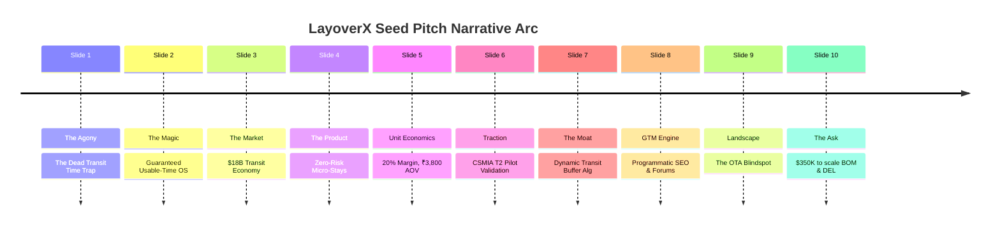

# Phase 8: Investor Pitch Deck Blueprint
**Target Audience:** Tier-1 Pre-Seed & Seed Venture Funds (Peak XV Spark, Blume Ventures, Surge, Antler India)  
**Round:** $350,000 USD on an i-SAFE note ($3.0M Post-Money Cap)  
**Vision:** Building the Operating System for Airport Transit & Layover Commerce.

---

## 10-Slide Seed Pitch Deck Structure

---

### Slide 1: The Problem — The Dead Transit Time Trap
- **The Traveler's Nightmare:** Every year, 380 million global passengers endure 4 to 12 hour airport layovers trapped in uncomfortable metal terminal chairs, facing freezing AC, subpar food, and exhausted layovers.
- **The Fear Barrier:** 84% of transit passengers refuse to exit the airport because of one terrifying anxiety: *"What if I get stuck in traffic and miss my connecting flight?"*
- **The Hotel's Loss:** 4-star and 5-star airport district hotels sit at 40% daytime vacancy between 10 AM and 5 PM, losing over ₹15,000 Cr ($1.8B) in unmonetized daytime capacity.

---

### Slide 2: The Solution — The Guaranteed Usable-Time Platform
- **LayoverX** transforms wasted layover hours into seamless, refreshing micro-vacations.
- **The Guarantee:** Our proprietary route engine calculates actual usable dwell time, guarantees on-time return to the departure gate, and backs it with a flight catch insurance guarantee.
- **1-Click Bundle:** Hourly day-use hotel room + left-luggage storage + flight-tracked chauffeur transfer, booked in under 60 seconds.

---

### Slide 3: Market Size — The Global Transit Corridor
- **TAM (Total Addressable Market):** **$18.4 Billion USD** (Global airport transit hospitality, lounges, and day-use services).
- **SAM (Serviceable Addressable Market):** **$3.2 Billion USD** (Middle East, South Asia, and Southeast Asia international transit hubs: Mumbai, Delhi, Dubai, Doha, Singapore).
- **SOM (Serviceable Obtainable Market):** **$48 Million USD** (15% market penetration across Mumbai CSMIA and Delhi IGI transit corridors over 36 months).

---

### Slide 4: The Product Ecosystem
- **Instant Usable Time Calculator:** Travelers enter arrival/departure flights; the system calculates exact usable minutes, accounting for CISF security, immigration, and terminal distances.
- **Daytime Hotel Micro-Stays:** 3-hour, 6-hour, and 9-hour slots at properties inside T2 (Niranta) and adjacent luxury properties (ITC Maratha, JW Marriott).
- **Luggage-Free Freedom:** Pre-reserved airport arrivals lockers so travelers explore hands-free.
- **Tamper-Proof Digital Voucher:** QR code boarding vouchers authenticated with SHA256 HMAC for seamless front-desk check-in.

---

### Slide 5: Business Model & Unit Economics
- **Revenue Model:** B2B2C Marketplace Take-Rate.
- **Average Order Value (AOV):** **₹3,800 INR (~$46 USD)** per booking.
- **Take-Rate:** **20% Platform Commission** on day rooms, dining, and transfers (₹760 gross margin per booking).
- **Luggage Storage Margin:** **40% Gross Margin** (₹120 per stored bag).
- **Customer Acquisition Cost (CAC):** **₹320 INR (~$3.80 USD)** driven by high-intent programmatic SEO and forum engagement.
- **LTV / CAC Ratio:** **4.8x** on single-trip utility, expanding to **7.2x** for recurring business flyers.

---

### Slide 6: Early Traction & Pilot Metrics (Mumbai CSMIA T2)
- **Waitlist & Pilot Volume:** 1,450+ verified transit itinerary calculations processed during pilot phase.
- **Inventory Supply Locked:** Direct B2B allocation agreements with premier Sahar transit properties representing 45 day-rooms daily.
- **Zero Missed Flight Record:** 100% on-time departure gate return rate across all pilot transit journeys.
- **Organic Traffic Growth:** Programmatic SEO landing pages ranking in top 3 search results for "6 hour layover Mumbai T2".

---

### Slide 7: The Moat — Technology & Inventory Defense
1. **Dynamic Dwell-Time Algorithm:** Real-time integration of flight delay telemetry, local traffic surges (monsoon/peak hour), and CISF terminal access restrictions.
2. **Proprietary Inventory Locking:** Distributed atomic mutexes and PostgreSQL row-level locks prevent double-booking of scarce daytime hotel slots.
3. **Exclusive Ground Network:** Airport parking dispatch partnerships ensuring sub-5-minute curbside chauffeur arrivals.

---

### Slide 8: Go-To-Market Engine
- **Programmatic Search Domination:** Capturing high-intent search queries (`/layover/bom-mumbai/6-hours`) before travelers board their origin flights.
- **Community Infiltration:** Authoritative guides on FlyerTalk, Reddit `r/travel`, and TripAdvisor forums.
- **B2B Airline & Crew Affiliates:** Strategic partnerships with flight booking engines and long-haul cabin crew networks.

---

### Slide 9: Competitive Landscape — The OTA Blindspot
- **Traditional OTAs (Booking.com, MakeMyTrip):** Hardcoded to overnight stays with 11 AM check-out and 2 PM check-in. Incapable of selling 4-hour midday slots.
- **Airport Lounges (Priority Pass, Dreamfolks):** Plagued by 45-minute entry queues, overcrowding, no private beds, and strict 3-hour visit caps.
- **Dayuse.com / ByHours:** Generic European focus without airport transit telemetry, flight tracking, or terminal security guarantees.
- **The LayoverX Advantage:** Built exclusively for the airport transit corridor with flight guarantees and end-to-end ground logistics.

---

### Slide 10: The Ask & Milestones
- **Raising:** **$350,000 USD** on an i-SAFE note ($3.0M Post-Money Valuation Cap).
- **Key 18-Month Milestones:**
  1. Scale Mumbai CSMIA T2 to 50 daily bookings ($70,000 Monthly GMV).
  2. Launch Delhi IGI Terminal 3 (India’s largest international transit hub).
  3. Integrate direct GDS / PNR API feeds for automated itinerary detection.
  4. Reach cash-flow break-even on the Indian corridor with 20% EBITDA margin.
