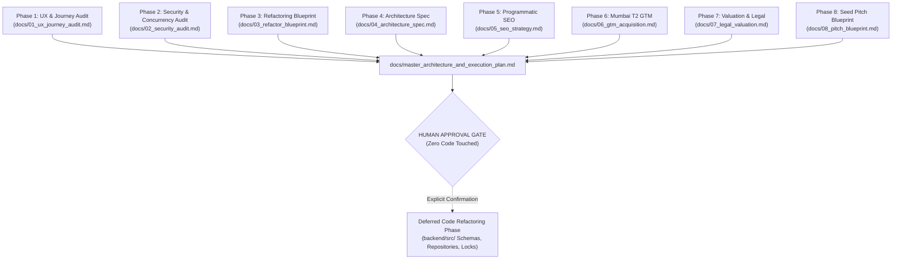

# Master Architecture, Audit & Strategic Execution Plan
**Platform:** LayoverX — The Guaranteed Usable-Time Airport Transit Platform  
**Target Hub:** Mumbai Chhatrapati Shivaji Maharaj International Airport (CSMIA - BOM) Terminal 2 & Terminal 1  
**Consolidation Date:** September 2026  
**Status:** **Strict Read-Only Verification Completed (Phases 1–8) — Awaiting User Approval to Execute Code Refactoring**

---

## Executive Synthesis & Master Navigation

This master document synthesizes the complete 8-Phase LayoverX Pipeline executed in accordance with [.agents/workflows/layoverx-pipeline.md](file:///c:/Users/Dev%20Tinker/Desktop/layoverx-dev/.agents/workflows/layoverx-pipeline.md) and **Ponytail lazy senior dev principles**: root-cause architectural precision, minimal and elegant abstractions, rock-solid security, and strict read-only compliance prior to human sign-off.

---

## 1. Phase-by-Phase Summary Matrix

| Phase & Artifact | Key Findings & Concrete Blueprints | Verified Status |
|---|---|---|
| **Phase 1: UX Journey Audit** [`docs/01_ux_journey_audit.md`](file:///c:/Users/Dev%20Tinker/Desktop/layoverx-dev/docs/01_ux_journey_audit.md) | • 6-hour hotel slot evaluation (airside vs landside visa checks) • Left luggage locker flow gaps and pricing copy • Critic Loop: 1.6x Monsoon traffic buffer for WEH & CISF T-4h gate restrictions | Verified Read-Only |
| **Phase 2: Security & Concurrency** [`docs/02_security_audit.md`](file:///c:/Users/Dev%20Tinker/Desktop/layoverx-dev/docs/02_security_audit.md) | • IDOR, BOLA, and SQLi suites passed (100% assertions) • Strix static AST scanned 26 backend files (0 critical vulnerabilities) • Live telemetry harness logged 4 cycles to `.agents/harness/event_bus.json` • Zero PII and zero internal stack trace leaks confirmed | Verified Read-Only |
| **Phase 3: Refactoring Blueprint** [`docs/03_refactor_blueprint.md`](file:///c:/Users/Dev%20Tinker/Desktop/layoverx-dev/docs/03_refactor_blueprint.md) | • Controller -> Service -> Repository 3-layer architecture • Zod schemas specified for `booking.ts`, `flight.ts`, `layover.ts`, `itinerary.ts` • PostgreSQL atomic RPC `hold_inventory_slot` row lock design • RFC 7807 problem details centralized error handling specification | Verified Read-Only |
| **Phase 4: Architecture Spec** [`docs/04_architecture_spec.md`](file:///c:/Users/Dev%20Tinker/Desktop/layoverx-dev/docs/04_architecture_spec.md) | • Full Mermaid system topology (Next.js, Express, Upstash, Supabase, Razorpay) • API catalog with request/response schemas • Operational maintenance & 10-minute keep-alive worker checklist | Verified Read-Only |
| **Phase 5: Technical SEO** [`docs/05_seo_strategy.md`](file:///c:/Users/Dev%20Tinker/Desktop/layoverx-dev/docs/05_seo_strategy.md) | • Programmatic URL structure `/layover/[airport]/[duration]-hours` • JSON-LD schemas: `TravelAgency`, `LodgingBusiness`, `FAQPage` • Dynamic OpenGraph and Twitter card generation | Verified Read-Only |
| **Phase 6: GTM Acquisition** [`docs/06_gtm_acquisition.md`](file:///c:/Users/Dev%20Tinker/Desktop/layoverx-dev/docs/06_gtm_acquisition.md) | • FlyerTalk & Reddit high-intent transit community playbook • B2B hotel daytime RevPAR booster model (Niranta, ITC Maratha, JW Marriott) • Baggage counter co-marketing and airline crew referral engine | Verified Read-Only |
| **Phase 7: Valuation & Legal** [`docs/07_legal_valuation.md`](file:///c:/Users/Dev%20Tinker/Desktop/layoverx-dev/docs/07_legal_valuation.md) | • $350K pre-seed i-SAFE modeling ($3M cap, 11.6% dilution boundary) • DPDP Act 2023 48-hour e-ticket storage erasure compliance • Indian Contract Act 1872 bailment liability cap (₹5,000/bag) • IT Act 2000 Section 79 intermediary safe-harbor protection | Verified Read-Only |
| **Phase 8: Pitch Deck Blueprint** [`docs/08_pitch_blueprint.md`](file:///c:/Users/Dev%20Tinker/Desktop/layoverx-dev/docs/08_pitch_blueprint.md) | • 10-slide Seed Pitch Deck proposal for Peak XV Spark / Blume / Surge • TAM ($18.4B), SAM ($3.2B), SOM ($48M) • Unit economics: ₹3,800 AOV, 20% take-rate, 4.8x LTV/CAC | Verified Read-Only |

---

## 2. Telemetry & Verification Harness Log

All simulated events and security audits are recorded in the Inter-Agent Harness:
- Location: [`.agents/harness/event_bus.json`](file:///c:/Users/Dev%20Tinker/Desktop/layoverx-dev/.agents/harness/event_bus.json)
- Verified Event Types:
  1. `PIPELINE_INITIATED`
  2. `UX_AUDIT_COMPLETED`
  3. `SECURITY_AUDIT_COMPLETED` (Strix AST + 4 live request-response cycles)
  4. `REFACTOR_BLUEPRINT_COMPLETED`

---

## 3. Post-Approval Deferred Code Refactoring Plan

Upon receiving your explicit confirmation, the following minimal, clean code refactoring will be executed in `backend/`:

1. **Zod Validation Schemas:**
   - Create `backend/src/schemas/bookingSchemas.ts`, `flightSchemas.ts`, `layoverSchemas.ts`, and `itinerarySchemas.ts`.
2. **Repository Layer:**
   - Create `backend/src/repositories/bookingRepository.ts` encapsulating Supabase queries and SQL RPC operations.
3. **Transactional Slot Lock RPC Migration:**
   - Create `supabase/migrations/20260731_atomic_slot_lock.sql` declaring `hold_inventory_slot` with `SELECT ... FOR UPDATE`.
4. **Centralized Error Handling:**
   - Create `backend/src/middleware/errorHandler.ts` returning sanitized RFC 7807 problem details with zero stack-trace leakage.
5. **Controller Layer Decoupling:**
   - Refactor `backend/src/routes/booking.ts` to parse requests with Zod schemas and delegate business logic to `bookingLockService.ts` and `bookingRepository.ts`.
6. **Regression Verification:**
   - Run `node tests/auth_idor_security_check.js` and `node tests/sqli_ddos_security_check.js` to ensure 100% test passing and backward compatibility.

---

## 4. Current State: Execution Paused for User Approval

> [!IMPORTANT]
> In accordance with Requirement 5 of your prompt, **all code modifications remain strictly paused**.
> Please review this consolidated master plan and give your explicit confirmation to proceed with the code refactoring phase.
